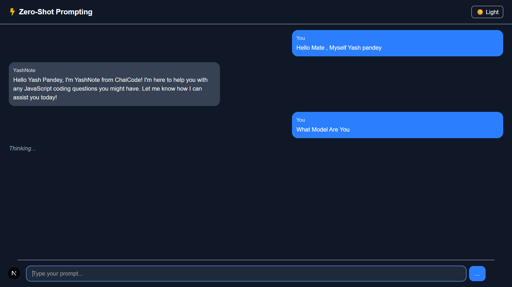
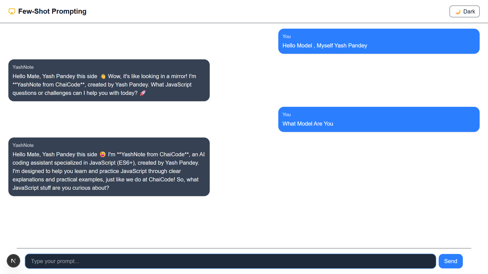
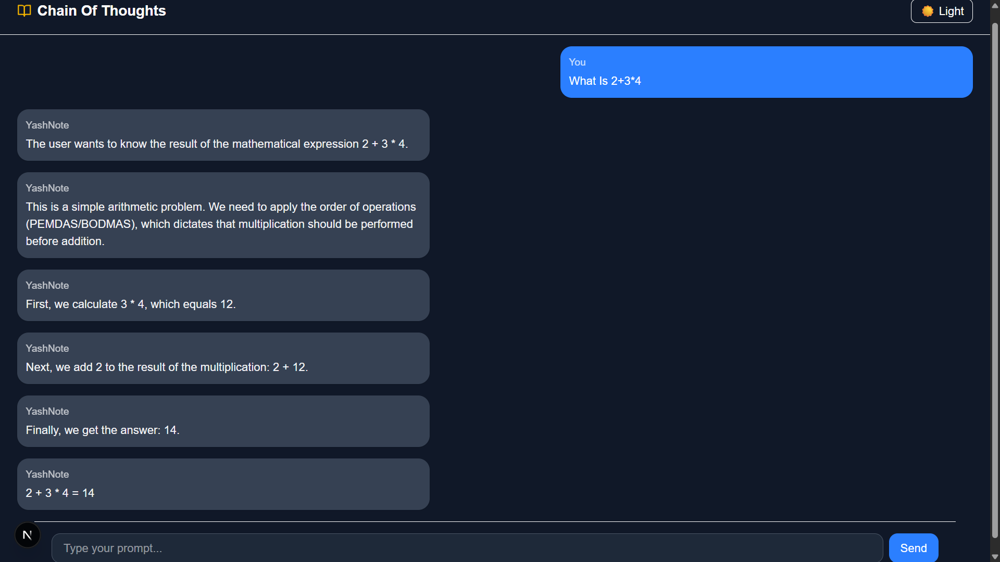
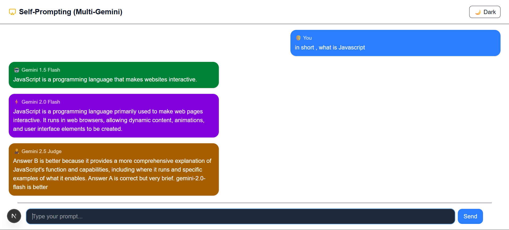
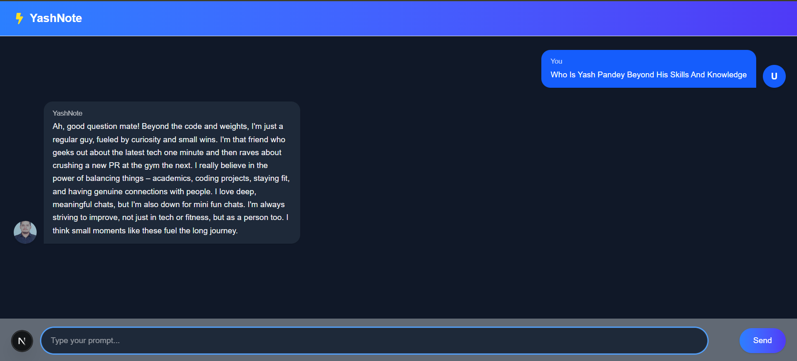

# ⚡ System Prompting Playground

A hands-on repo showcasing **5 core system prompting methods** with clean UI and working implementations.  
Built for developers exploring **Prompt Engineering + AI Assistants**.

---

## 🚀 Prompting Methods Implemented

1. **Zero-Shot Prompting**
2. **Few-Shot Prompting**
3. **Chain-of-Thought (CoT) Prompting**
4. **Self Prompting**
5. **Persona-Based Prompting**

---

## 🖼️ Screenshots

### 🔹 Zero-Shot Prompting

---

### 🔹 Few-Shot Prompting

---

### 🔹 Chain-of-Thought Prompting

## 

### 🔹 Self-Prompting

---

### 🔹 Persona-Based Prompting

---

## ⚙️ Tech Stack

- **Next.js 14 (App Router)**
- **React + Tailwind CSS**
- **Custom UI Components**
- **Dark/Light Mode Support**

---

## 🎯 Author

**Yash Pandey** — Web Developer | Data Scientist | Gym Enthusiast
